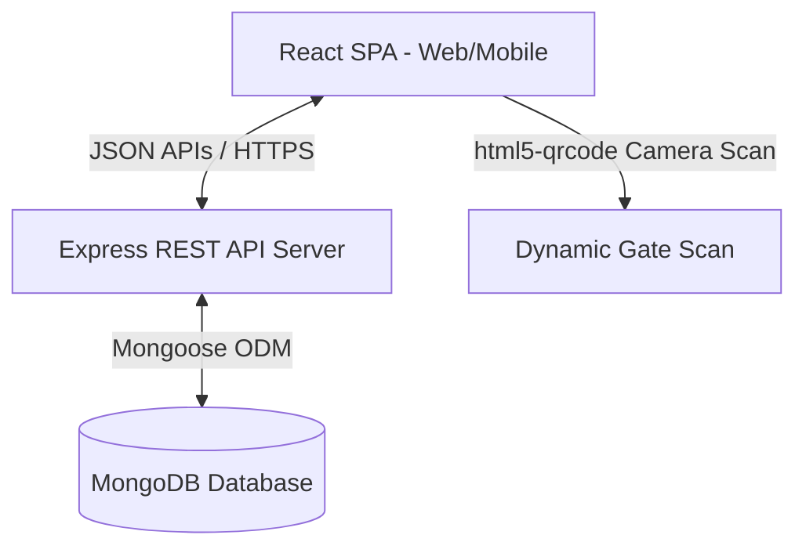
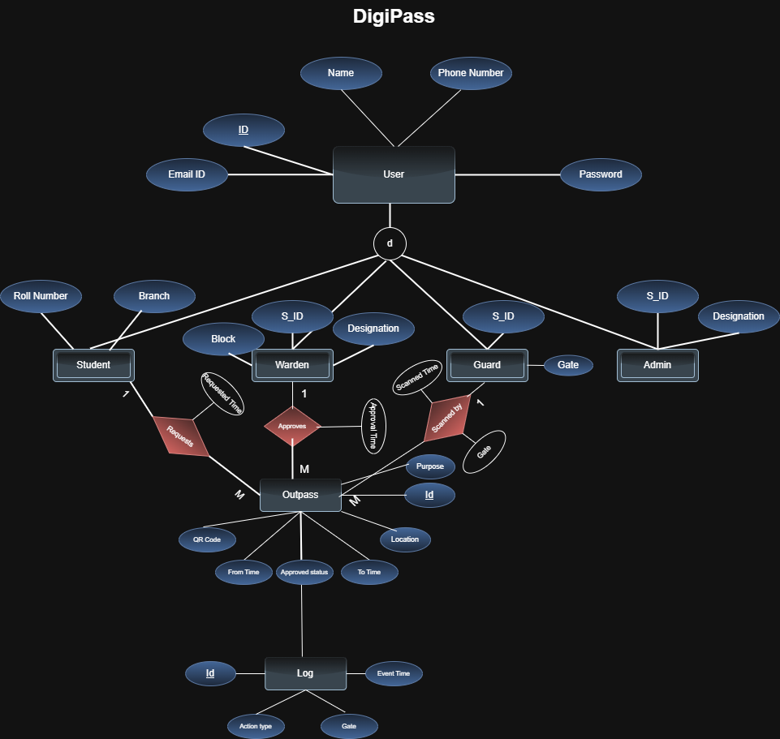
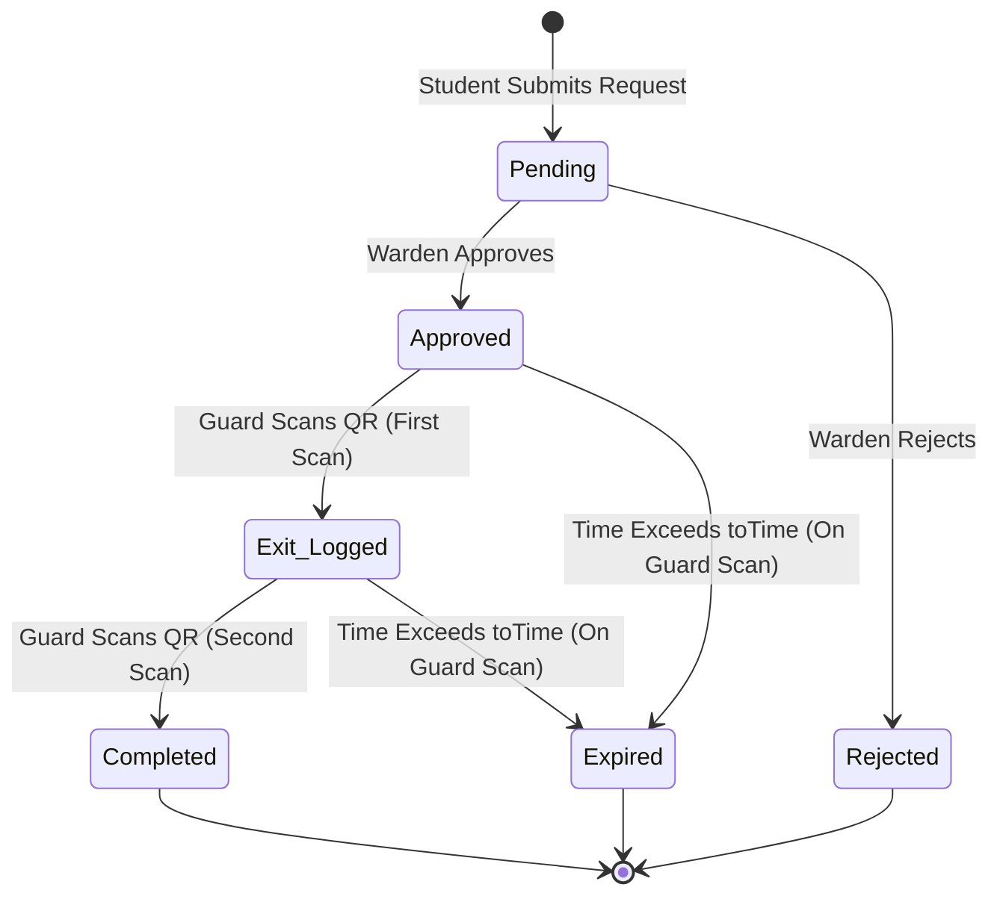
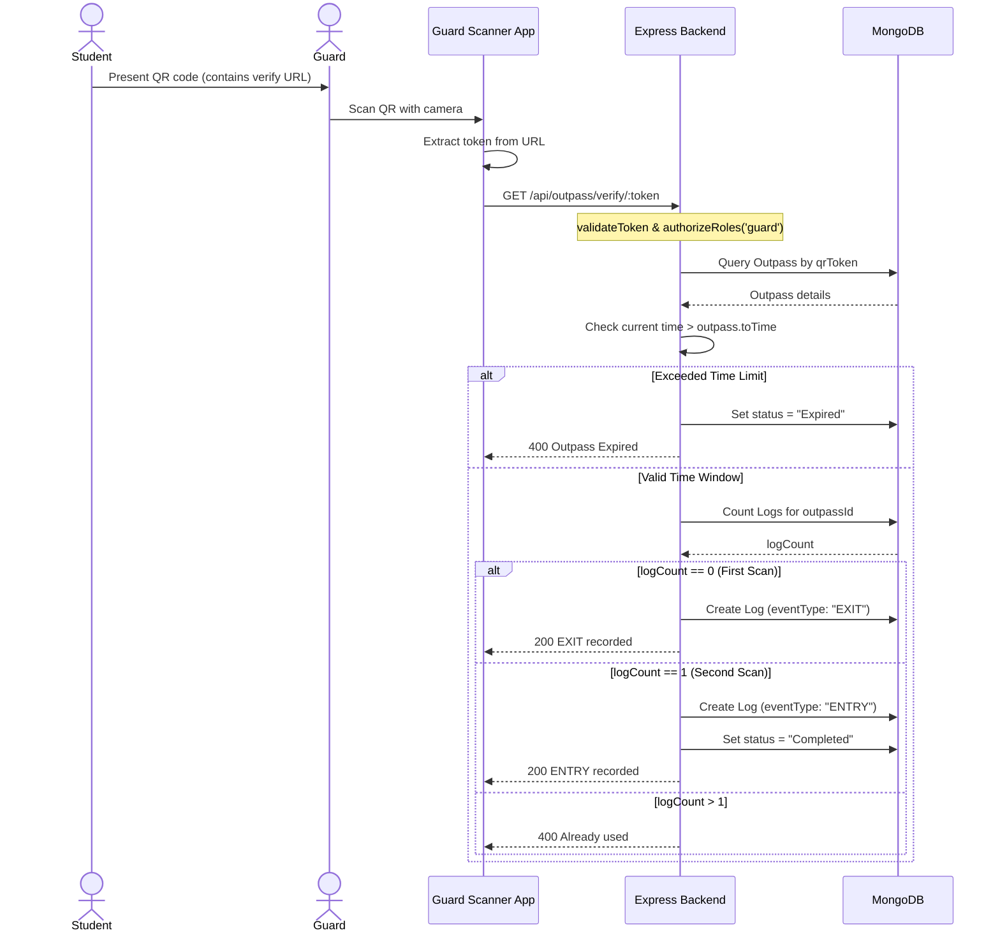

# Software Architecture Document - DigiPass

This document details the high-level architecture, component designs, database schemas, lifecycles, request flows, and security mechanics of the **Digital Outpass & Permission Management System (DigiPass)**.

---

## 1. High-Level Architecture

DigiPass implements a decoupled Client-Server architecture tailored for mobile-first institutional use. 

*   **Frontend (React SPA Client)**: Serves as the user interface, utilizing role-based views. It implements camera-based QR scanning directly in the browser.
*   **Backend (Express API Server)**: Standard REST API containing modular routes, controllers, middleware, and business logic schemas.
*   **Database Layer (MongoDB + Mongoose)**: Stores core user records, role-specific metadata, outpass tokens, and verification audit trails.

---

## 2. Frontend Architecture

The frontend is constructed using React 19 and Vite.

*   **Routing System**: Structured using `react-router-dom` in [AppRoutes.jsx](file:///c:/Users/nagav/Downloads/WinterProjects/DigiPass/frontend/src/routes/AppRoutes.jsx). Access-restricted endpoints are nested under a [ProtectedRoute.jsx](file:///c:/Users/nagav/Downloads/WinterProjects/DigiPass/frontend/src/components/ProtectedRoute.jsx) wrapper which verifies local authentication details.
*   **State Management**: Locally managed at the view level using React state hooks (`useState`, `useEffect`) and shared using persistent tokens stored in `localStorage`.
*   **Aesthetics & Micro-Animations**: Tailored stylesheets are linked directly with views. Smooth UX cues (like chevron hovers and pin drops) are animated using `framer-motion` (defined in [Animations.jsx](file:///c:/Users/nagav/Downloads/WinterProjects/DigiPass/frontend/src/components/Animations.jsx)).
*   **Dynamic QR Display**: Reads `qrToken` from the backend upon leave approval, forming the verification endpoint URL: `${baseURL}/outpass/verify/${token}`. It then utilizes the `qrcode` library to render this URL into a QR image canvas.
*   **QR Scanner Page**: Instantiates a browser camera instance via `html5-qrcode` in [Scan.jsx](file:///c:/Users/nagav/Downloads/WinterProjects/DigiPass/frontend/src/pages/Guard/Scan.jsx). Once captured, it extracts the token and navigates the guard to `/verify/${token}`.

---

## 3. Backend Architecture

The backend consists of an Express application written in Node.js.

*   **Routing Layout**: Routes are isolated and registered on the Express instance in [server.js](file:///c:/Users/nagav/Downloads/WinterProjects/DigiPass/backend/src/server.js).
*   **Controller Layer**: Separates database actions from router registrations. The controllers interact with Mongoose models, enforce state transitions, and generate tokens.
*   **Middleware Chain**:
    1.  `cors`: Handles origin authorizations.
    2.  `express.json()`: Parses incoming requests.
    3.  `validateToken`: Verifies authorization bearer JWTs.
    4.  `authorizeRoles`: Validates roles against the route scope.
    5.  `errorHandler`: Intercepts thrown exceptions and standardizes HTTP error payloads.

---

## 4. Database Architecture & ER Diagram

The database uses MongoDB with Mongoose schemas mapped to represent users and permissions.

### Entity Relationship Model

The updated database schema is embedded below. It represents inheritance from the base `User` model alongside the relationships to the `Outpass` and `Log` tables:

---

## 5. Authentication & Authorization Flows

### Authentication Flow
1.  User submits credentials (email and password) to `/api/signIn`.
2.  The backend verifies user presence and uses `bcrypt.compare` to match the hashed password.
3.  If verified, the server signs a JSON Web Token (JWT) with the payload structure `{ user: { name, email, id, role } }`. The token is set to expire in 30 minutes.
4.  The client receives the token, stores it in `localStorage` under key `Token`, fetches the profile details `/api/users/me`, writes the user's role to `localStorage` under `role`, and redirects the user to their role-specific dashboard.

### Authorization Flow
Role protection is enforced through middleware at two checkpoints:

*   **Frontend Checkpoint**: [ProtectedRoute.jsx](file:///c:/Users/nagav/Downloads/WinterProjects/DigiPass/frontend/src/components/ProtectedRoute.jsx) intercepts route transitions, checking if `localStorage.getItem('role')` belongs to `allowedRoles`. If not, it redirects to `/Unauthorized` or `/`.
*   **Backend Checkpoint**: [authorizeRoles.js](file:///c:/Users/nagav/Downloads/WinterProjects/DigiPass/backend/src/middleware/authorizeRoles.js) validates the decoded JWT role in `req.user.user.role`. If matching fails, it immediately responds with `403 Access denied`.

---

## 6. Outpass & QR Lifecycle

### State Definitions
*   **Pending**: The initial request state. Outpass contains no QR token.
*   **Rejected**: Warden denies the request. Outpass is locked from changes.
*   **Approved**: Warden approves the request. A 16-byte random hex `qrToken` is generated.
*   **Exit_Logged (Active Out)**: Student has left the gate. An `EXIT` log is written.
*   **Completed**: Student has returned. An `ENTRY` log is written, and the outpass status transitions to `Completed`.
*   **Expired**: The current time has surpassed the outpass `toTime` boundary before completing the flow.

---

## 7. Verification & Movement Logging Flow

When the student presents the QR code to the Security Guard, the following sequence is executed:

---

## 8. Security Architecture

1.  **Cryptographical Integrity**: Passwords are securely hashed via `bcrypt` with 10 salt rounds.
2.  **Stateless JWT Security**: API endpoints use tokenized headers (`Authorization: Bearer <token>`) to establish secure, stateless sessions.
3.  **QR Obfuscation**: The QR code only exposes a random 32-character hexadecimal token. Outpass IDs or student metrics are never directly encoded in the QR, preventing ID harvesting or query tampering.
4.  **Verification Checkpoints**: Every scan executes check assertions for:
    *   Outpass existency.
    *   Warden approval status verification.
    *   Outpass already-used validations.
    *   Explicit validity time window bounds check.

---

